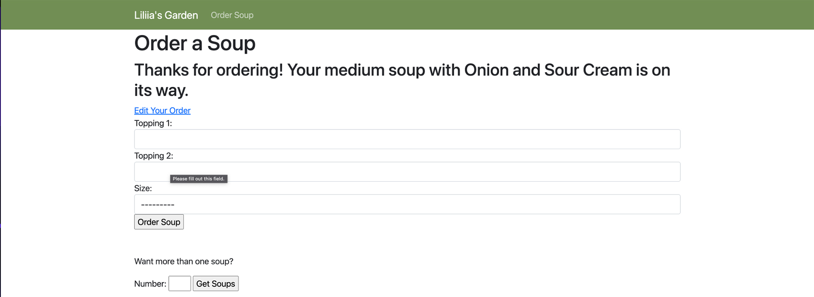

<h1 align="center">Liliia's Garden</h1>
This is a Django web application that allows users to order healthy soups online.

## Features
Users can order a single soup with desired toppings and size.
Users can order multiple soups at once by specifying the number of soups they want.
Users can edit an existing order.
## Screenshots
Here are some screenshots of the website:

### Home Page

### Order Page

### Multiple Soup Order Page

### Edit Order Page

## Installation
To run the website, you need to have Python and Django installed on your system. Follow these steps to install and run the website:

>Clone the repository: git clone https://github.com/YuliiaHavrylenko/liliiasgarden-project.git

>Go to the project directory: cd liliiasgarden-project

>Install the requirements: pip install -r requirements.txt

>Run the server: python manage.py runserver

>Open the website in your browser: http://localhost:8000

## Usage
### Ordering a Single Soup
* Go to the order page.
* Fill in the soup size, topping 1, and topping 2 fields.
* Click on the "Order Soup" button.
* You will see a confirmation message with your order details.
### Ordering Multiple Soups
* Go to the multiple soup order page.
* Specify the number of soups you want to order.
* Fill in the details for each soup.
* Click on the "Order Soups" button.
* You will see a confirmation message with your order details.
### Editing an Order
* Go to the edit order page.
* Fill in the new details for your order.
* Click on the "Update Order" button.
* You will see a confirmation message with your updated order details.